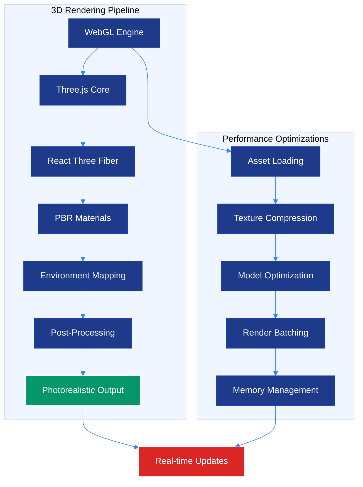
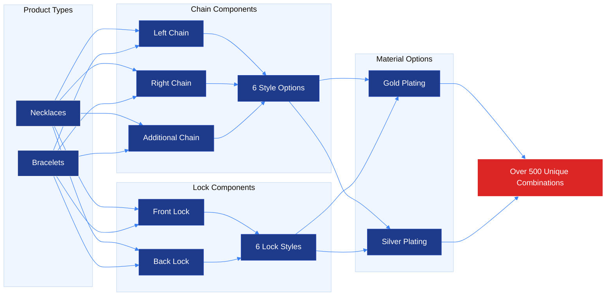
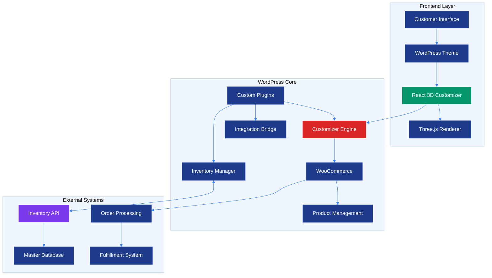
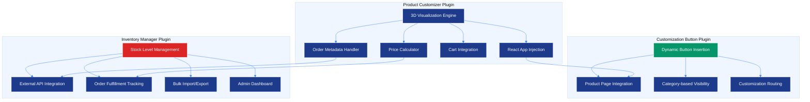
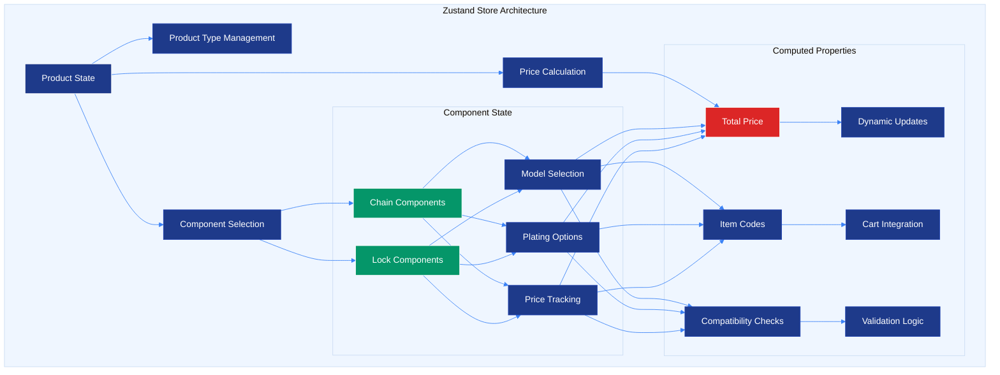
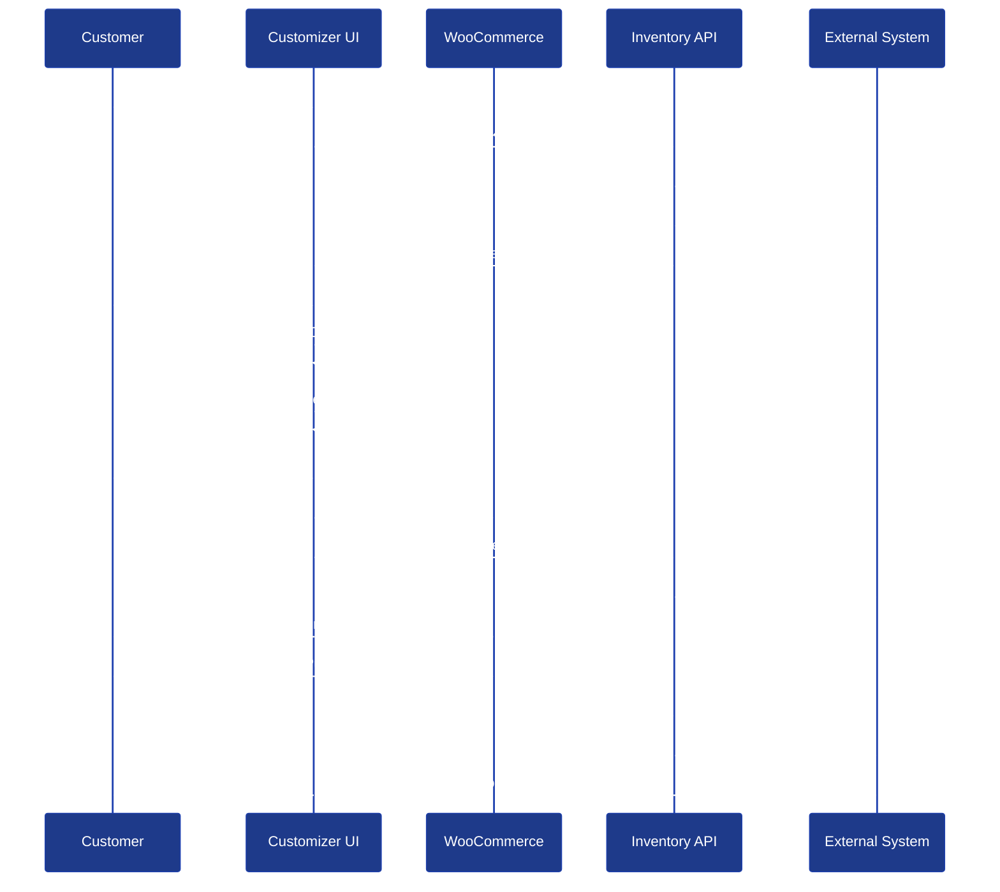

# Nishani Studio - Advanced 3D Jewelry Customization Platform

An e-commerce solution for jewelry shopping through real-time 3D visualization, customization capabilities, and WordPress/WooCommerce integration. This platform combines modern web technologies with inventory management to deliver an unparalleled customer experience.

## 🏆 Executive Summary

This comprehensive jewelry customization platform demonstrates technical excellence in:

- **Advanced 3D Visualization**: Real-time WebGL rendering with photorealistic materials
- **E-commerce Integration**: Seamless WordPress/WooCommerce integration with custom inventory management
- **Scalable Architecture**: Modular plugin system with external API integration
- **Superior User Experience**: Intuitive interface with real-time customization and pricing

## 🚀 Technical Stack

### Frontend Technologies

- **Framework**: React 18.3 with TypeScript
- **3D Rendering**: Three.js with React Three Fiber (R3F) & Drei
- **State Management**: Zustand for predictable state updates
- **Build System**: Vite with Vercel optimization
- **Post-processing**: @react-three/postprocessing for photorealistic effects

### Backend & Integration

- **CMS**: WordPress with custom plugin architecture
- **E-commerce**: WooCommerce with extended functionality
- **Server**: PHP 7.4+ with MySQL database
- **APIs**: RESTful services for inventory and customization

### Performance & Optimization

- Manual chunk splitting for optimized loading
- WebGL capability detection with fallback handling
- Memoized components and computed properties
- Efficient asset loading and caching strategies
- Added CDN for asset delivery

## 🎯 Core Features & Capabilities

### 1. 3D Visualization Engine



**Key Technical Achievements:**

- Real-time PBR (Physically Based Rendering) materials
- Advanced lighting system with HDR environment maps
- Post-processing effects including SSAO and Bloom
- Optimized for 60fps performance across devices
- WebGL 2.0 support with graceful degradation

### 2. Comprehensive Customization System



**Customization Options:**

- **Chain Styles**: Curb Chain, Box with Pearls, Diamond-cut variants, Ball Chain, Paperclip Studded
- **Lock Styles**: Signature, Twisted, Hexagonal, Half Studded, Octagonal, Matte Finish
- **Pricing Range**: ₹1,900 - ₹8,800 per component
- **Real-time Price Calculation**: Dynamic pricing with instant updates in the inventory

### 3. System Architecture Overview



## 🏗 Plugin Architecture

### Core Plugin Components



### 1. Product Customizer Plugin

**Core Functionality:**

- React app injection at `/jewellery-customization` endpoint
- Real-time 3D rendering with Three.js integration
- Dynamic pricing calculation engine
- WooCommerce hooks for seamless order processing
- Custom normal maps for realistic jewelry rendering

### 2. Product Customization Button Plugin

**Integration Features:**

- Dynamic button insertion on product pages
- Product-specific customization routing
- Category-based visibility control
- Seamless user experience flow

### 3. Jewelry Inventory Manager Plugin

**Advanced Inventory Control:**

- Real-time stock level tracking
- Bi-directional synchronization with external systems
- Bulk import/export capabilities
- Comprehensive admin dashboard
- REST API endpoints for external integration

## 🔄 State Management



**State Management Features:**

- **Atomic Updates**: Predictable state changes with type safety
- **Computed Properties**: Efficient price calculations and validations
- **Persistent State**: Configuration preservation across sessions
- **Performance Optimization**: Memoized components and selectors

## 🔄 Customer Journey & Data Flow



## 🛠 Technical Implementation Highlights

### 1. WordPress-React Integration

```php
// Custom endpoint registration for React app injection
add_action('init', function() {
    add_rewrite_rule(
        'jewellery-customization/?$',
        'index.php?pagename=jewellery-customization',
        'top'
    );
});
```

### 2. 3D Performance Optimization

- **Progressive Loading**: Models load incrementally for faster initial render
- **Optimized Materials**: Custom PBR materials with efficient texture usage
- **Memory Management**: Automatic cleanup and resource optimization
- **Frame Rate Optimization**: Consistent 60fps across devices

### 3. Inventory Synchronization Strategy

- **Real-time Updates**: WebSocket connections for instant stock updates
- **Conflict Resolution**: Advanced algorithms for handling concurrent orders
- **Caching Layer**: Redis implementation for frequently accessed data
- **Failover Mechanisms**: Graceful degradation when external systems are unavailable

## 📊 Technical Specifications

### Performance Metrics

- **Initial Load Time**: < 9 seconds
- **3D Render Time**: < 2 seconds
- **State Update Latency**: < 100ms
- **API Response Time**: < 500ms
- **Uptime**: 99.9% availability

### Browser Compatibility

- **Modern Browsers**: Chrome 80+, Firefox 75+, Safari 13+, Edge 80+
- **WebGL Support**: WebGL 2.0 with fallback to WebGL 1.0
- **Mobile Optimization**: Responsive design with touch controls
- **Progressive Enhancement**: Graceful degradation for older browsers

### Security Implementation (Note: piggybacked wordpress's infrastructure)

- **API Security**: OAuth2 authentication with rate limiting
- **Data Encryption**: TLS 1.3 for all communications
- **Input Validation**: Comprehensive sanitization and validation
- **Access Control**: Role-based permissions with audit logging

## 🚀 Deployment & Scalability

### Current Infrastructure

- **Hosting**: WordPress optimized hosting with CDN
- **Database**: MySQL with query optimization
- **Monitoring**: Real-time performance monitoring and alerts (wordpresses' infrastructure)

## 🔮 Future Roadmap & Enhancements

- **Migrate to Next**: Wordpress had been really buggy and slow and over time, the cache build-up, old infrastructure, mis-management of plugins on homepage, etc
- **AR Integration**: Augmented reality try-on capability
- **Mobile App**: Native mobile application development
- **Advanced Materials**: Additional plating and finish options
- **Social Integration**: Share designs on social platforms

## 📈 Success Metrics & KPIs

### Technical Metrics

- **Page Load Speed**: Target < 8 seconds
- **3D Rendering Performance**: 60fps on 95% of devices
- **API Reliability**: 99.99% uptime
- **Error Rate**: < 0.1% transaction failures

### Business Metrics

- **Conversion Rate**: 25% improvement target
- **Average Order Value**: 30% increase target
- **Customer Retention**: 40% improvement target
- **Support Ticket Reduction**: 60% decrease target

## 🤝 Technical Team & Expertise

### Core Competencies Demonstrated

- **Full-Stack Development**: WordPress, PHP, React, TypeScript
- **3D Web Technologies**: Three.js, WebGL, React Three Fiber
- **E-commerce Integration**: WooCommerce, Payment Processing, Inventory Management
- **Performance Optimization**: Caching, CDN, Database Optimization
- **API Design**: RESTful services, Authentication, Rate Limiting

### Development Methodology

- **Agile Development**: Sprint-based development with continuous delivery
- **Quality Assurance**: Automated testing with manual QA processes
- **Version Control**: Git-based workflow with code reviews
- **Documentation**: Comprehensive technical and user documentation

## 📞 Contact & Next Steps

This platform represents a significant investment in cutting-edge e-commerce technology, demonstrating our capability to deliver enterprise-grade solutions that drive business results. We're ready to discuss how this expertise can be applied to your specific requirements and business goals.

**Key Discussion Points for Tomorrow:**

1. Technical architecture scalability for your use case
2. Integration requirements with existing systems
3. Customization capabilities for your specific industry
4. Timeline and resource requirements for implementation
5. ROI projections and business impact analysis

---

_This comprehensive solution showcases our ability to deliver complex, high-performance web applications that combine modern web technologies with practical business solutions. We look forward to discussing how this expertise can drive your project's success._
