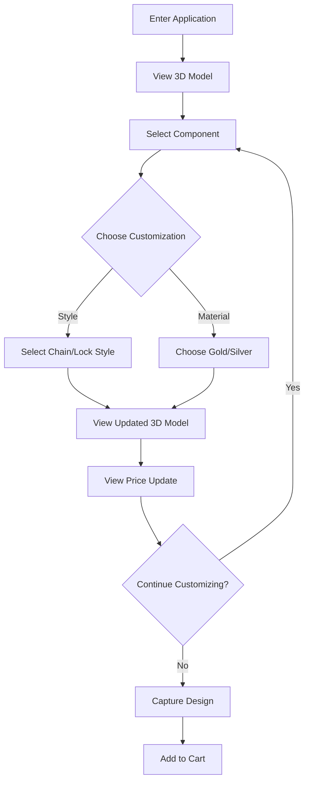

# Custom 3D Jewelry Configurator

A cutting-edge React application showcasing advanced 3D visualization and real-time customization of jewelry pieces. Built with React Three Fiber and modern state management, this application demonstrates technical excellence in web-based 3D rendering and user interaction.

## 🚀 Technical Stack

- **Frontend Framework**: React 18.3
- **3D Rendering**: Three.js with React Three Fiber & Drei
- **State Management**: Zustand
- **Build Tool**: Vite
- **Deployment**: Vercel-optimized
- **Post-processing**: @react-three/postprocessing
- **TypeScript** for type safety

## 🎯 Key Features

### 1. Advanced 3D Visualization

- Real-time 3D rendering with PBR materials
- Enhanced lighting system with environment maps
- Post-processing effects (SSAO, Bloom) for photorealistic rendering
- Optimized performance with manual chunk splitting
- WebGL support detection and fallback handling

### 2. Interactive Customization

- Dynamic part selection and modification
- Real-time material changes (Gold/Silver plating)
- Multi-component jewelry configuration
  - Chain customization (Left, Right, Additional)
  - Lock customization (Front, Back)
- Responsive style selection interface

### 3. State Management

- Centralized state management using Zustand
- Real-time price calculations
- Persistent configuration state
- Type-safe state updates

### 4. User Experience

- Intuitive 3D controls
  - Orbit rotation
  - Zoom functionality
  - Pan controls
- Interactive help system
- Responsive design for all devices
- High-quality snapshot generation
- Real-time price updates

## 🔄 User Flow



## 💻 Technical Architecture

### Component Structure

```
src/
├── components/
│   ├── common/
│   │   ├── ProductView.tsx        # 3D viewer component
│   │   ├── ChainCustomizer.tsx    # Chain customization interface
│   │   ├── StyleSelector.tsx      # Style selection component
│   │   ├── MetalSelector.tsx      # Material selection
│   │   └── ...
│   ├── Bracelet.tsx              # Bracelet 3D model
│   └── Necklace.tsx              # Necklace 3D model
├── store/
│   └── store.ts                  # Zustand store configuration
├── types/
│   └── type.ts                   # TypeScript definitions
└── App.jsx                       # Main application component
```

### State Management Flow

1. **Product Configuration State**

   - Product type (necklace/bracelet)
   - Selected components
   - Material selections
   - Price calculations

2. **3D Rendering State**

   - Camera positions
   - Material properties
   - Lighting configuration
   - Post-processing effects

3. **UI State**
   - Selected components
   - Active customization panels
   - Help system visibility
   - Loading states

## 🔧 Technical Optimizations

1. **Performance**

   - Chunked JavaScript bundles
   - Optimized 3D model loading
   - Efficient state updates
   - Memoized components

2. **3D Rendering**

   - Custom environment mapping
   - Optimized material systems
   - Efficient post-processing pipeline
   - WebGL capability detection

3. **State Management**
   - Atomic state updates
   - Computed properties
   - Type-safe actions
   - Persistent state handling

## 🌟 Unique Selling Points

1. **Technical Excellence**

   - Advanced 3D visualization
   - Real-time customization
   - Optimized performance
   - Type-safe codebase

2. **User Experience**

   - Intuitive interface
   - Responsive design
   - Real-time updates
   - High-quality visuals

3. **Business Value**
   - Increased customer engagement
   - Reduced returns through accurate visualization
   - Enhanced product customization
   - Scalable architecture

## 🚀 Deployment

The application is optimized for Vercel deployment with:

- Automatic production builds
- Asset optimization
- Edge network distribution
- Continuous deployment

## 📈 Future Enhancements

1. **Technical**

   - AR visualization support
   - Advanced material systems
   - Enhanced post-processing effects
   - Performance optimizations

2. **Features**

   - Additional customization options
   - Social sharing integration
   - Save/load configurations
   - Enhanced analytics

3. **Business**
   - Integration with inventory systems
   - Advanced pricing models
   - Customer behavior analytics
   - A/B testing support

## 🔒 Security & Performance

- Secure asset loading
- Optimized 3D model loading
- Efficient state management
- Type-safe operations
- WebGL support detection
- Fallback rendering options

---

This project demonstrates technical excellence in modern web development, combining advanced 3D visualization with intuitive user interaction. It showcases the ability to build complex, performant applications while maintaining clean, maintainable code.
